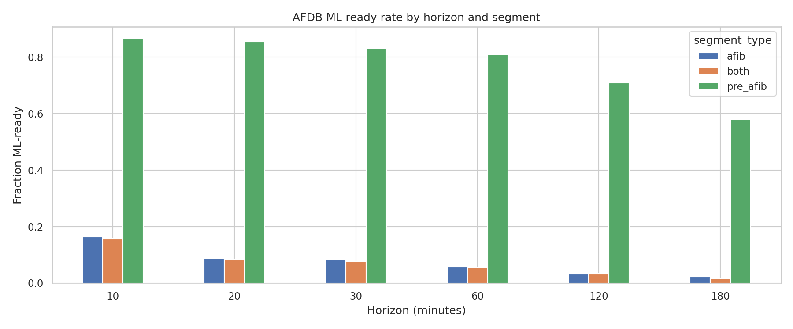
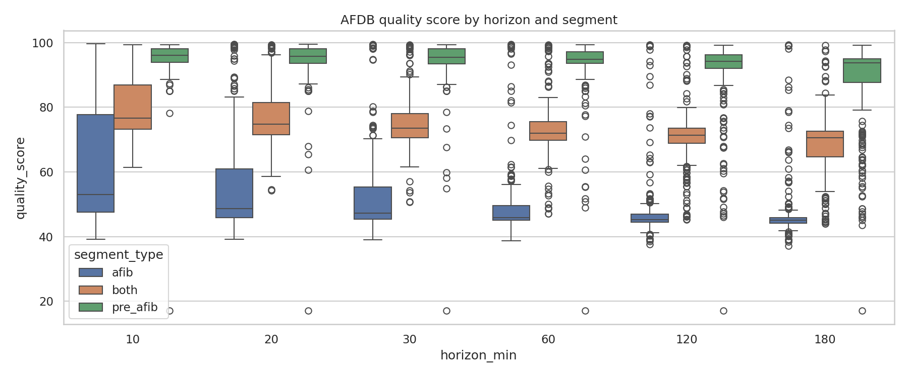
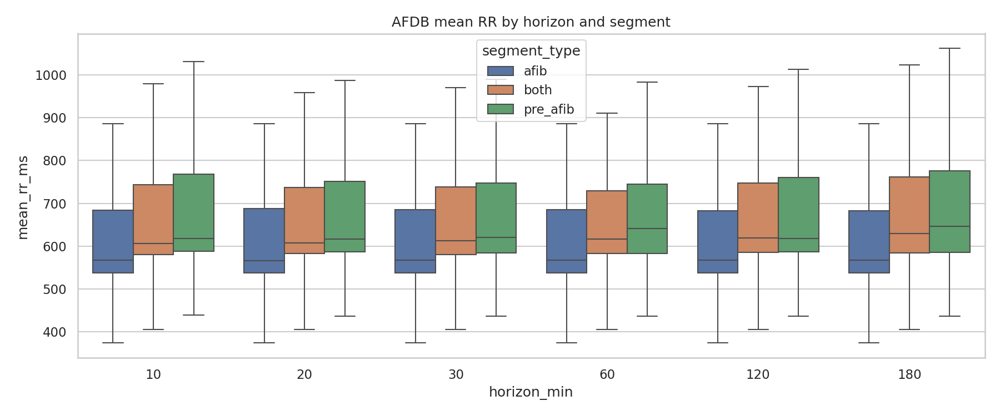
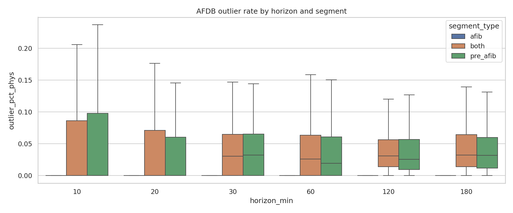
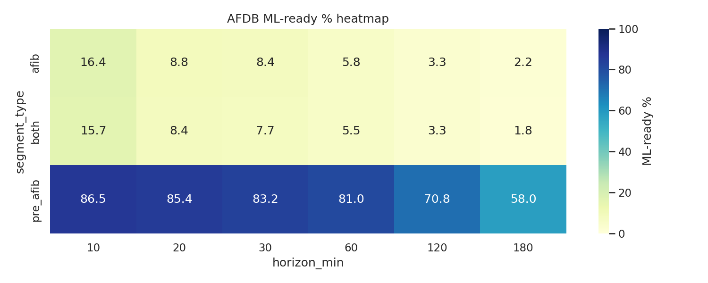
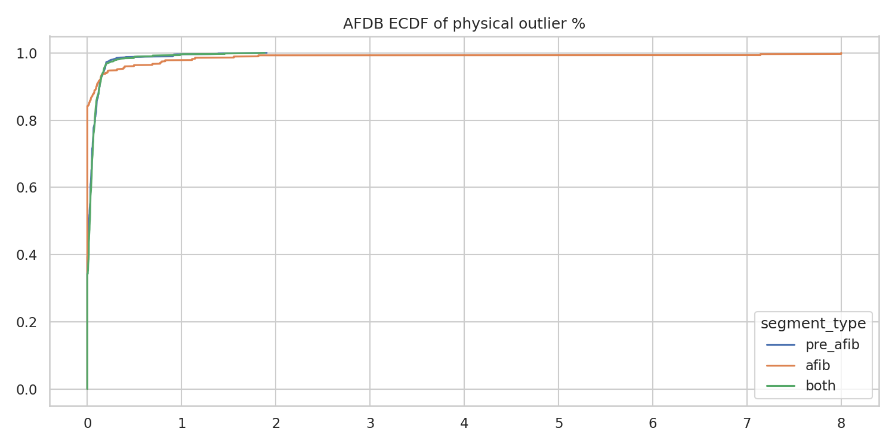
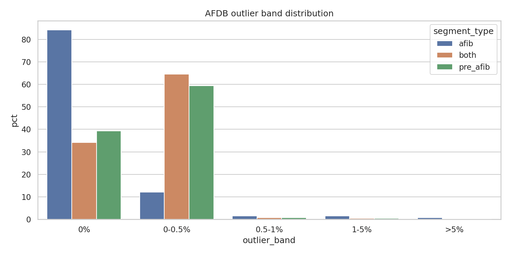

# AFDB Pre-AFib + AFib + Combined Episode Analysis

> Generated on 2026-03-21 15:07:55

## Method

- Episodes loaded from `afdb/sr_to_af_segments.csv`.
- RR derived from beat annotations with preference `.qrsc` then `.qrs`.
- pre_afib: last H minutes before AF onset; afib: first H inside AF segment.
- both: concatenation pre_afib + afib, target duration 2H.

## Summary

| segment_type | horizon_min | n_rows | sufficient_% | ml_ready_% | mean_quality | mean_rr_count | mean_mean_rr_ms | mean_std_rr_ms |
|---|---:|---:|---:|---:|---:|---:|---:|---:|
| afib | 10 | 274 | 16.42 | 16.42 | 63.11 | 324.7 | 604.5 | 150.6 |
| afib | 20 | 274 | 8.76 | 8.76 | 56.93 | 430.5 | 605.0 | 150.8 |
| afib | 30 | 274 | 8.39 | 8.39 | 54.17 | 512.5 | 604.7 | 151.0 |
| afib | 60 | 274 | 5.84 | 5.84 | 50.96 | 710.4 | 604.6 | 151.2 |
| afib | 120 | 274 | 3.28 | 3.28 | 48.65 | 964.9 | 604.3 | 151.3 |
| afib | 180 | 274 | 2.19 | 2.19 | 47.52 | 1104.5 | 604.4 | 151.4 |
| both | 10 | 274 | 16.79 | 15.69 | 80.19 | 1216.4 | 678.5 | 136.9 |
| both | 20 | 274 | 9.12 | 8.39 | 77.03 | 2206.9 | 678.6 | 132.6 |
| both | 30 | 274 | 8.39 | 7.66 | 75.49 | 3168.3 | 678.0 | 130.9 |
| both | 60 | 274 | 5.84 | 5.47 | 73.21 | 5944.8 | 679.6 | 129.0 |
| both | 120 | 274 | 3.28 | 3.28 | 70.64 | 11030.4 | 682.2 | 125.6 |
| both | 180 | 274 | 1.82 | 1.82 | 68.40 | 15423.4 | 684.0 | 123.4 |
| pre_afib | 10 | 274 | 98.54 | 86.50 | 95.26 | 891.7 | 691.5 | 125.9 |
| pre_afib | 20 | 274 | 97.45 | 85.40 | 94.80 | 1776.4 | 687.1 | 124.4 |
| pre_afib | 30 | 274 | 97.08 | 83.21 | 94.45 | 2655.7 | 685.0 | 123.7 |
| pre_afib | 60 | 274 | 94.16 | 81.02 | 93.45 | 5234.3 | 685.0 | 123.2 |
| pre_afib | 120 | 274 | 85.04 | 70.80 | 91.02 | 10065.5 | 686.8 | 120.5 |
| pre_afib | 180 | 274 | 70.80 | 58.03 | 88.10 | 14318.9 | 688.4 | 118.5 |

## Visualizations

