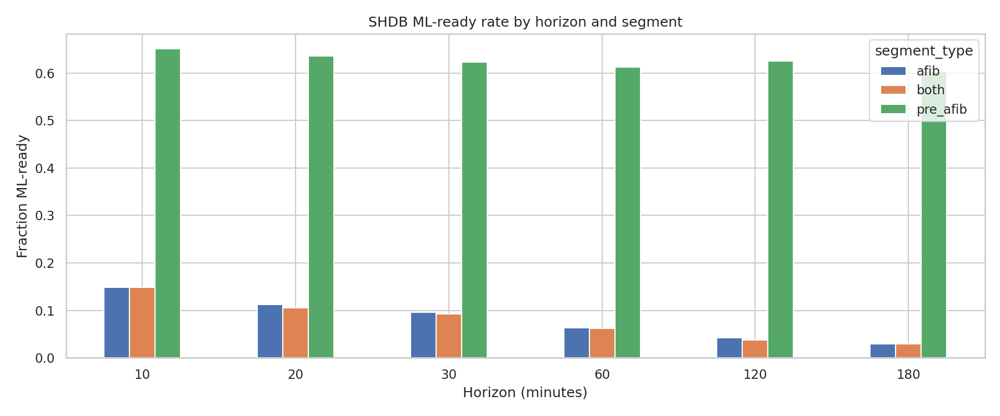
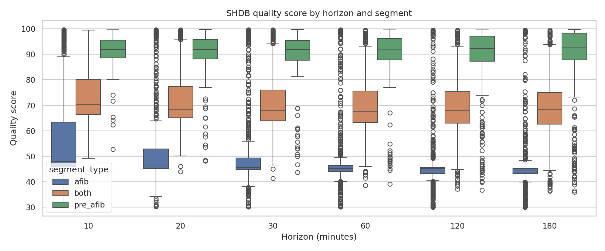
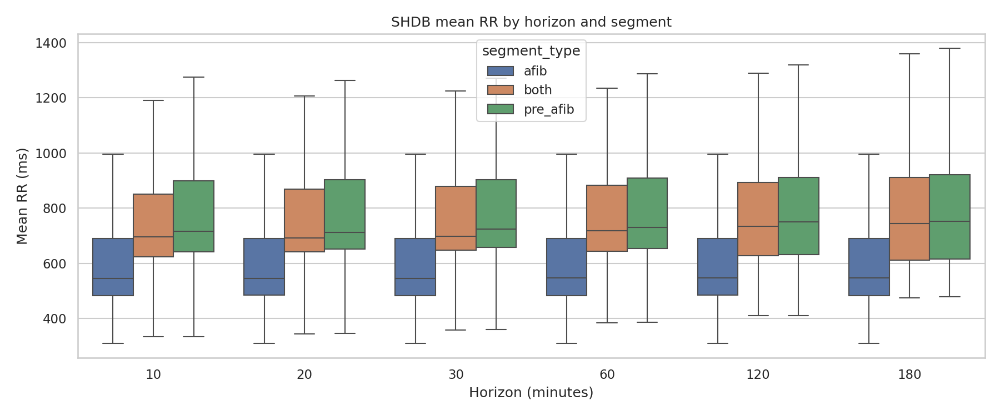
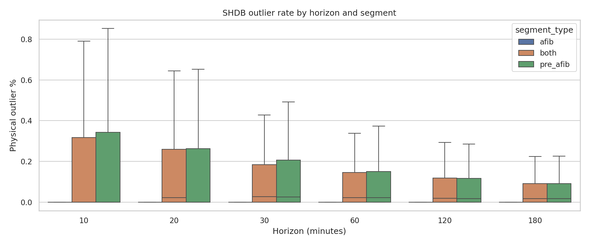
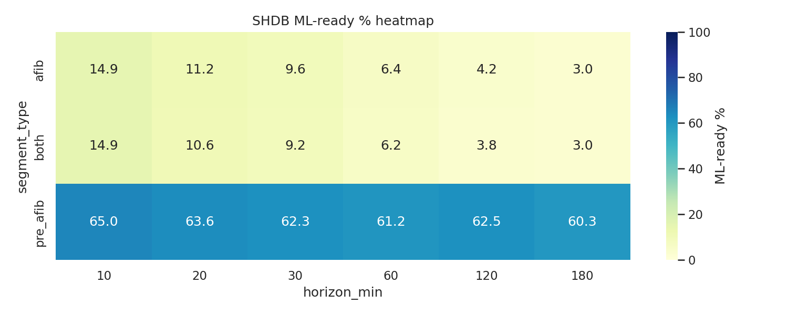
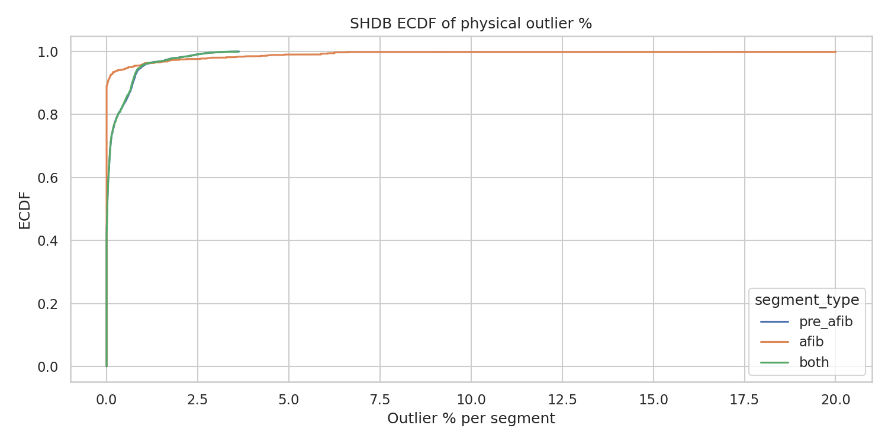
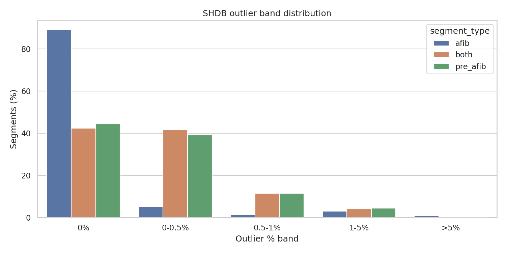

# SHDB Pre-AFib + AFib + Combined Episode Analysis

> Generated on 2026-03-21 14:55:15

## Objective

Analyze RR windows of 10, 20, 30, 60, 120, 180 minutes for pre_afib, afib, and both using SHDB SR->AF episodes.

## Method

- Episodes loaded from `shdb/sr_to_af_segments.csv`.
- RR derived from consecutive QRS peaks in `.qrs` (or corrected peaks if provided).
- AF RR range: intervals whose leading beat timestamp lies inside `[af_start_sample, af_end_sample)`.
- pre_afib: last H minutes before AF onset.
- afib: first H minutes inside AF segment.
- both: concatenation pre_afib + afib, target duration 2H minutes.
- First 60s of RR removed by cumulative-duration calibration cut.

## Summary by segment_type × horizon

| segment_type | horizon_min | n_rows | sufficient_% | ml_ready_% | mean_quality | mean_rr_count | mean_mean_rr_ms | mean_std_rr_ms |
|---|---:|---:|---:|---:|---:|---:|---:|---:|
| afib | 10 | 738 | 16.40 | 14.91 | 58.03 | 279.3 | 611.0 | 150.8 |
| afib | 20 | 738 | 11.92 | 11.25 | 54.24 | 410.0 | 611.9 | 151.1 |
| afib | 30 | 738 | 10.30 | 9.62 | 52.44 | 514.4 | 612.1 | 151.2 |
| afib | 60 | 738 | 6.91 | 6.37 | 49.89 | 735.3 | 612.5 | 151.6 |
| afib | 120 | 738 | 4.34 | 4.20 | 47.74 | 1005.5 | 612.7 | 152.0 |
| afib | 180 | 738 | 3.25 | 2.98 | 46.71 | 1197.7 | 612.5 | 151.9 |
| both | 10 | 738 | 16.80 | 14.91 | 74.31 | 1112.2 | 749.2 | 258.4 |
| both | 20 | 738 | 11.92 | 10.57 | 72.20 | 2054.4 | 761.2 | 253.5 |
| both | 30 | 738 | 10.43 | 9.21 | 71.20 | 2956.1 | 769.0 | 250.3 |
| both | 60 | 738 | 7.05 | 6.23 | 69.94 | 5542.1 | 778.6 | 245.2 |
| both | 120 | 738 | 4.34 | 3.79 | 68.86 | 10336.7 | 788.3 | 236.8 |
| both | 180 | 738 | 3.25 | 2.98 | 68.32 | 14927.2 | 793.8 | 228.4 |
| pre_afib | 10 | 738 | 98.92 | 65.04 | 91.72 | 832.9 | 777.5 | 254.8 |
| pre_afib | 20 | 738 | 97.97 | 63.55 | 91.28 | 1644.4 | 781.6 | 248.9 |
| pre_afib | 30 | 738 | 97.70 | 62.33 | 91.07 | 2441.7 | 786.9 | 245.5 |
| pre_afib | 60 | 738 | 95.53 | 61.25 | 90.83 | 4806.8 | 792.4 | 240.7 |
| pre_afib | 120 | 738 | 93.22 | 62.47 | 90.28 | 9331.2 | 799.7 | 232.1 |
| pre_afib | 180 | 738 | 91.87 | 60.30 | 90.00 | 13729.4 | 804.4 | 223.9 |

## Cleanliness verification

| segment_type | horizon_min | n_nonempty | global_outlier_% | fail(>5%)_% | fail(dup>10%)_% | fail(rr<200)_% |
|---|---:|---:|---:|---:|---:|---:|
| afib | 10 | 738 | 0.1727 | 0.95 | 8.54 | 69.11 |
| afib | 20 | 738 | 0.1540 | 0.95 | 8.40 | 69.11 |
| afib | 30 | 738 | 0.1414 | 0.95 | 8.40 | 69.11 |
| afib | 60 | 738 | 0.1236 | 0.95 | 8.54 | 69.11 |
| afib | 120 | 738 | 0.1016 | 0.95 | 8.27 | 69.11 |
| afib | 180 | 738 | 0.0949 | 0.95 | 8.40 | 69.11 |
| both | 10 | 738 | 0.2729 | 0.00 | 31.30 | 0.14 |
| both | 20 | 738 | 0.2657 | 0.00 | 31.57 | 0.14 |
| both | 30 | 738 | 0.2661 | 0.00 | 33.47 | 0.14 |
| both | 60 | 738 | 0.2375 | 0.00 | 33.88 | 0.14 |
| both | 120 | 738 | 0.1821 | 0.00 | 33.47 | 0.14 |
| both | 180 | 738 | 0.1517 | 0.00 | 35.50 | 0.14 |
| pre_afib | 10 | 738 | 0.3065 | 0.00 | 34.01 | 0.14 |
| pre_afib | 20 | 738 | 0.2936 | 0.00 | 34.96 | 0.14 |
| pre_afib | 30 | 738 | 0.2924 | 0.00 | 36.18 | 0.14 |
| pre_afib | 60 | 738 | 0.2549 | 0.00 | 36.99 | 0.14 |
| pre_afib | 120 | 738 | 0.1908 | 0.00 | 35.50 | 0.14 |
| pre_afib | 180 | 738 | 0.1567 | 0.00 | 37.67 | 0.14 |

## Visualizations

---

*Generated by `shdb/pre_afib_afib_combined_analysis.py`*